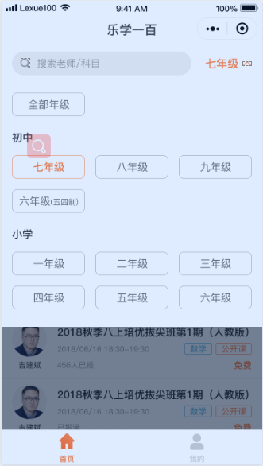
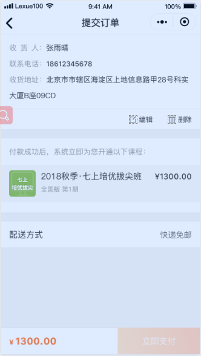

# **开发乐学一百（微信小程序）**

## **预览**

## **技术站**
   wxml: 用微信api提供的语法模板。 js:用javascript。es6, wxss:用flex。

## **实现功能**

### **首页**
- 首页实现了 **搜索栏功能**和 **年级筛选功能、学科筛选功能、轮播图、课程列表等下拉加载等功能** 

#### **课程详情页**
- 课程详情页实现了 **学期类型的切换、教材版本的选择、下拉到一定的高度固定标题、点击（课程详情，课程大纲，上课需知滚动到固定的区域）、客服、立即报名等功能**

#### **获取手机号码页**
- 获取手机号码页实现了 **用手机号码直接登录获取授权和账户登录等功能**

#### **登录页**
- 登录页实现了 **用学号和手机号码进行登录、如果没有账号下面实现了账户注册入口**

#### **注册页**
- 注册页实现了 **调取验证码接口、用正则验证密码是否是6-18个字符**

### **我的**

#### **登录页**
- 登录页实现如果还没登录，就出现登录页入口按钮

#### **我的页面**
- 如果登录了就出现 **切换用户、我的订单、我的优惠券、设置等功能**。点击切换用户就跳到**登录页**，点击我的订单就跳到**我的订单页**点击**我的优惠券**跳到我的**优惠券页面**点击设置是 是否开启微信设置地址权限功能。
#### **我的订单页**
- 我的订单页实现了 **全部订单、待支付、已完成、立即支付等功能**

## 最后 ##
- 最后想看实现的样子的话可以在微信小程序里面搜索**乐学一百**就能看到实现的效果了。

